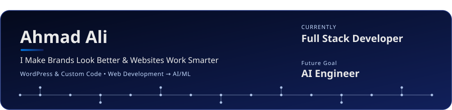

---

### Hey, I'm Ahmad aka Deven 👋

Explore me at

</td>
</tr>
</table>


<a href="https://www.linkedin.com/in/devenahmad/" target="_blank"></a>
<a href="https://github.com/devenahmad" target="_blank"></a>
<a href="https://www.behance.net/devenahmad" target="_blank"></a>
<a href="http://instagram.com/devenahmad" target="_blank"></a>
<a href="mailto:totheahmad@gmail.com"></a>


</div>

---

### 🧭 About

I'm a Brand & UI/UX Designer and WordPress Developer with 5+ years of experience in design and web builds. I'm currently pursuing my BSCS and struggling to become an AI/ML Engineer, actively moving my career from design into engineering.

My path looks like this:

```
Design  →  WordPress / Web Dev  →  Frontend  →  Full-Stack  →  AI/ML
(solid)    (solid)                 (solid)      (learning)    (exploring)
```

I'm not claiming to be a full-stack or AI engineer yet, I'm documenting the transition as I build it, one project at a time.

[](https://git.io/typing-svg)

---

### 🔭 Currently Exploring

- 🎨 Web Development
- 🧩 Full-Stack Development
- 🤖 AI / ML


### 🛠️ Tech Stack

**Design**

[](#)
[](#)
[](#)

**Web / WordPress**

[](#)
[](#)
[](#)
[](#)
[](#)

**Currently Learning**

[](#)
[](#)
